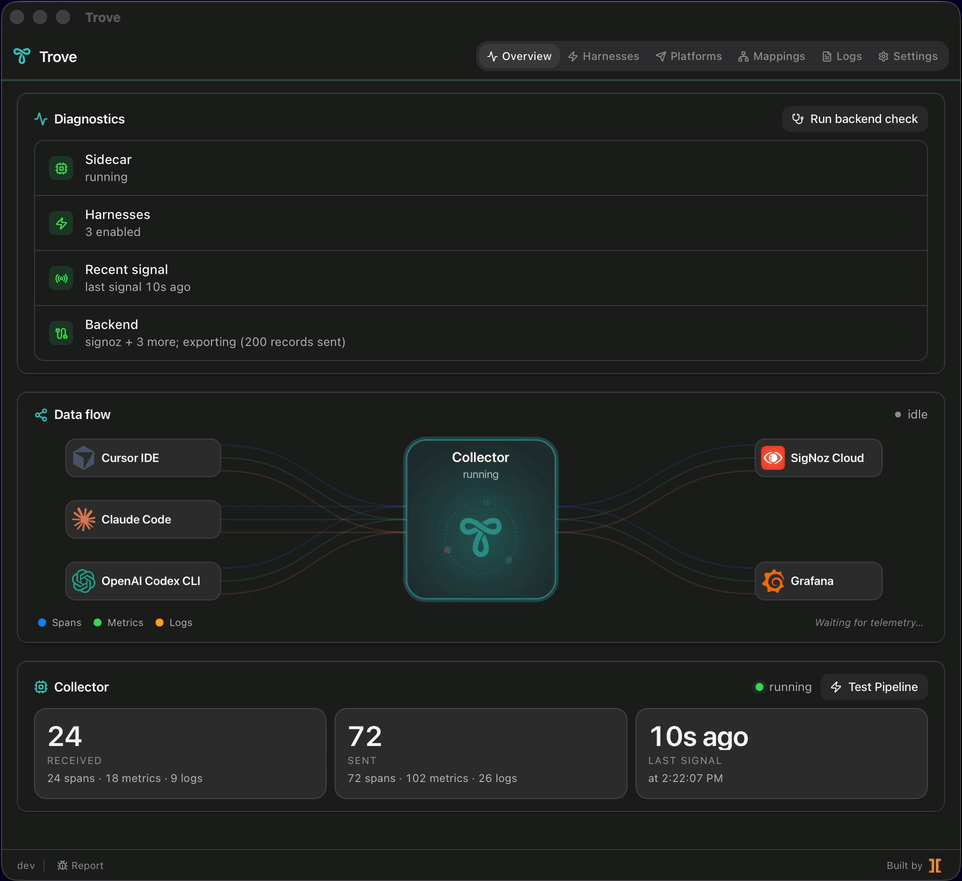
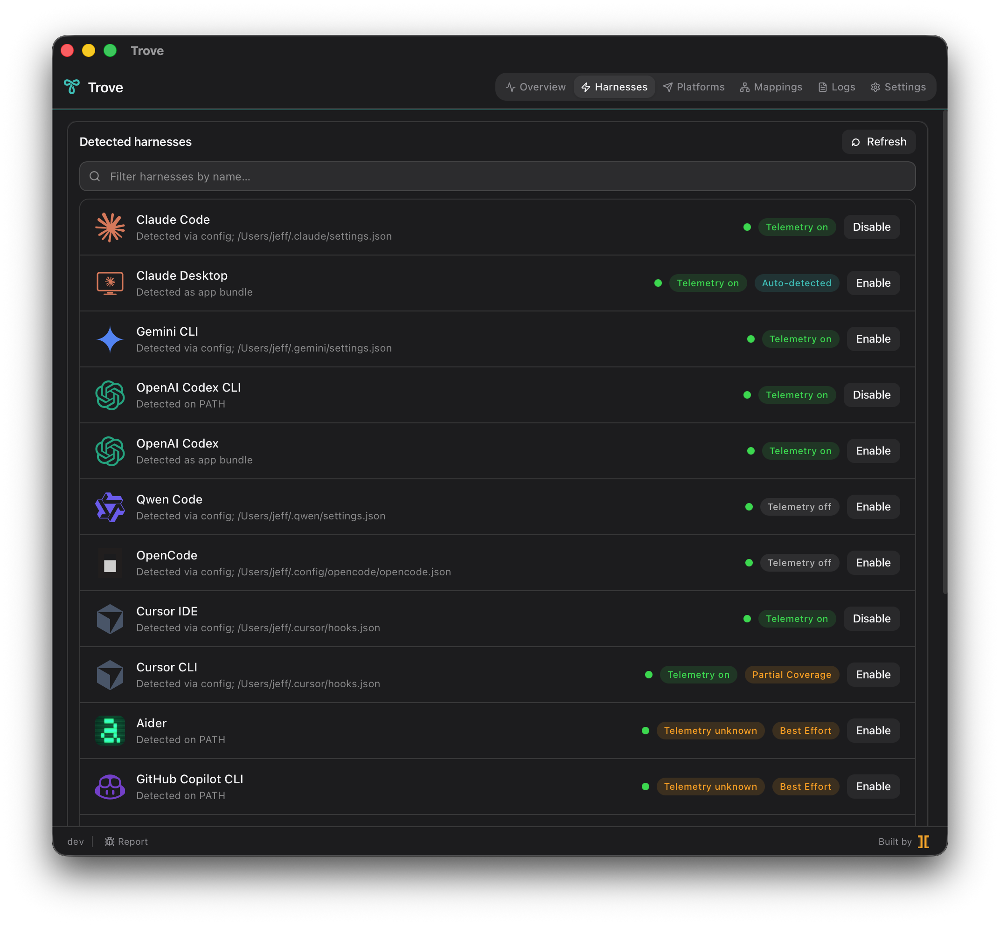
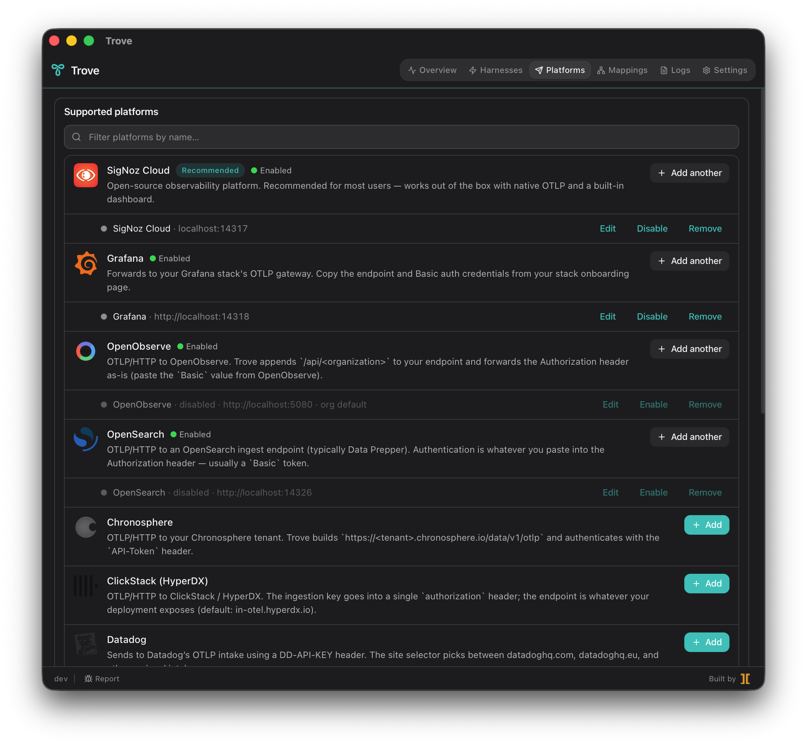
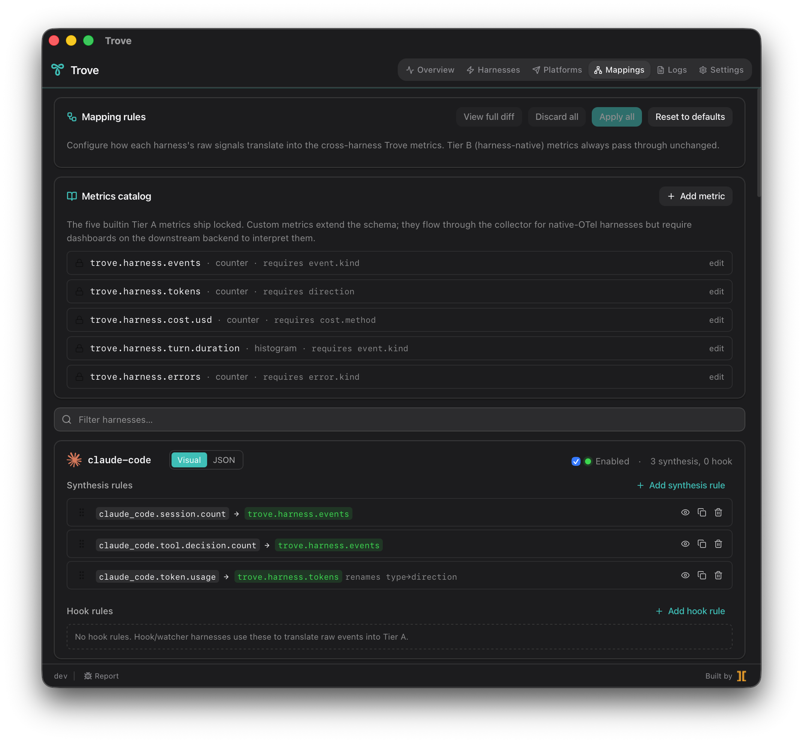

# Trove

**One tray app. Every AI coding tool on your machine. Unified OpenTelemetry, flowing to your observability backend; never ours.**

Trove auto-detects 17 AI coding harnesses (Claude Code, Gemini CLI, Codex, Cursor, OpenCode, Cline, Aider, GitHub Copilot CLI, and more), patches each one's telemetry config to emit OTLP, normalizes the cross-vendor signals through a bundled OpenTelemetry Collector, and forwards a unified stream to whichever observability backend you already own: SigNoz, Honeycomb, Datadog, Grafana, New Relic, OpenSearch, Splunk, Elastic, your own self-hosted Collector, or any generic OTLP endpoint.

[](https://github.com/Intevity/trove/actions/workflows/ci.yml)
[](https://github.com/Intevity/trove/releases/latest)
[](https://github.com/Intevity/trove/releases)
[](./LICENSE)
[](#your-data-never-leaves-your-machine)
[](#your-data-never-leaves-your-machine)
[](#your-data-never-leaves-your-machine)
[](./vitest.config.ts)
[](#download)
[](https://nodejs.org)
[](https://tauri.app)
[](https://www.typescriptlang.org)

<p align="center"></p>

---

## Why Trove

AI coding tools have a telemetry problem. Every vendor invented their own dialect, every install hides the wiring in a different file, and the data either stays trapped in a proprietary dashboard or gets handed to the vendor as a side effect of you using their CLI. Trove flips that around: point each tool at a local Trove collector once, and from then on every signal your team generates lands in a backend you control, typed consistently, attributed by harness, and auditable end-to-end.

That matters to different people for different reasons.

#### 🔧 For engineering leads

- **One pane of glass across mixed-harness teams.** Half the team uses Claude Code, the other half is on Cursor plus Copilot CLI, the platform team trialed Codex last week. Without Trove, that's four separate vendor dashboards (or four blanks). With Trove, every span, metric, and log carries a `harness.id` resource attribute so you can compare them side-by-side in one query.
- **Native OTel where it exists, best-effort where it doesn't.** Claude Code, Gemini CLI, Codex, Qwen, OpenCode, and Cursor ship native OTLP; Trove flips the right flags and routes them through. Cline, Aider, and Copilot CLI don't emit OTel natively, so Trove installs lightweight watchers and shell-rc wrappers that derive equivalent OTLP records from their on-disk logs. The derived records share the same queries as their native peers.
- **Reversible.** Every "Enable" writes a sentinel-bracketed managed region into the harness's config file. One click reverts it byte-for-byte. No half-applied states, no orphaned env vars, no "I uninstalled Trove but my CLI still POSTs to localhost."

#### 💸 For finance, ops, and platform owners

- **Detect dead seats before renewal.** Your org pays for Cursor, Copilot, Claude Code, and Codex licenses across 200 engineers; Trove tells you which seats actually fire, by user, by week, by tool. The same `harness.id`-keyed metric stream that powers the engineering dashboard also surfaces "this license has zero turns in the last 30 days" rows that procurement can act on.
- **Cross-vendor cost normalization.** Token counts, model-call counts, and turn durations all flow through the same Tier-A metric schema (`trove.harness.tokens`, `trove.harness.events`, `trove.harness.cost.usd`, `trove.harness.turn.duration`, `trove.harness.errors`). Cost per turn for Claude Code is directly comparable to cost per turn for Copilot CLI in your own dashboard, with no vendor-specific exporter to maintain.
- **Your contract, your data residency.** Telemetry leaves the machine only toward the backend _you_ configured. Trove never phones home, never aggregates user data, and has no SaaS layer that could change its mind about pricing or data-sharing policies next quarter.

#### 🔒 For security and IT

- **Localhost-only.** The bundled OpenTelemetry Collector listens on `127.0.0.1` and forwards exclusively to the endpoint you set. No third-party SDK in the dependency tree phones a vendor.
- **OS-keychain credential storage.** Backend tokens, API keys, and ingest secrets all live in macOS Keychain, Windows Credential Manager, or Linux Secret Service. Never in plaintext JSON, never in env files, never logged.
- **Auditable, reversible config patches.** Every file Trove touches is wrapped in a sentinel-bracketed managed block; diff it, audit it, revert it. The schema for what got written is captured in `state.json` and signed off on per-apply.
- **MIT-licensed, fully open source.** Every line of TypeScript, every Rust handler, every adapter is auditable. CI gates ≥ 95% test coverage on the shared schema layer where security-sensitive logic lives.

#### Your data never leaves your machine

- ✅ **No telemetry.** No analytics. No crash reporting. The collector binds to `127.0.0.1` and forwards only to the endpoint you configured.
- ✅ **Credentials in your OS keychain:** Keychain on macOS, Credential Manager on Windows, libsecret on Linux. Never in plaintext files, never in logs.
- ✅ **Reversible patches.** Every "Enable" can be cleanly undone; the original file is restored byte-for-byte.
- ✅ **MIT-licensed and fully open source.** Every component (Rust core, React UI, custom OTel Collector build, harness adapters) is auditable.

---

## 17 harnesses, auto-detected on launch

Trove sweeps the standard install paths for every supported AI coding tool the moment it starts, surfaces what's on disk, and lets you enable telemetry per-tool with a single click. Toggle one row and Trove writes a managed region into that tool's config file; the row turns green the moment OTLP starts flowing through the local collector.

<p align="center"></p>

Supported today:

| Tier             | Harness                | Telemetry source                                    |
| ---------------- | ---------------------- | --------------------------------------------------- |
| Native OTel      | Claude Code            | Built-in `OTEL_EXPORTER_OTLP_*` env vars            |
| Native OTel      | Claude Desktop         | Auto-detected via local audit log (no setup)        |
| Native OTel      | Gemini CLI             | Built-in OTel exporter                              |
| Native OTel      | OpenAI Codex CLI       | Codex 0.130+ `[otel.exporter.otlp-http]` block      |
| Native OTel      | OpenAI Codex (desktop) | Shares Codex CLI's `codex app-server` backend       |
| Native OTel      | Qwen Code              | Built-in OTel exporter                              |
| Native OTel      | OpenCode               | Built-in OTel exporter                              |
| Native OTel      | Cursor IDE             | Cursor hooks via `~/.cursor/hooks.json`             |
| Partial coverage | Cursor CLI             | Subset of Cursor hook events (shell exec only)      |
| Best effort      | Cline                  | Watcher derives OTLP from Cline's task records      |
| Best effort      | Aider                  | Shell-rc wrapper tees session log into OTLP         |
| Best effort      | GitHub Copilot CLI     | Shell-rc wrappers around `copilot` and `gh copilot` |
| Setup guide      | Junie CLI              | Setup guide (JetBrains)                             |
| Setup guide      | Droid (factory.ai)     | Setup guide                                         |
| Setup guide      | Kimi Code CLI          | Setup guide                                         |
| Setup guide      | Devin                  | Setup guide                                         |
| Setup guide      | ForgeCode              | Setup guide                                         |

When a harness is enabled, Trove shows it in the Overview Data flow chart (≤ 3 tools render as individual nodes; 4+ collapse into an animated "Orbital Hub" cluster) with per-source activity halos that light up when telemetry is flowing.

---

## 15 platforms, configure once

Trove forwards to any backend that speaks OTLP. Thirteen come with pre-built credential forms; two escape hatches (Generic OTLP, Local Collector passthrough) cover everything else.

<p align="center"></p>

| Platform                         | Auth pattern                           |
| -------------------------------- | -------------------------------------- |
| **SigNoz Cloud** _(recommended)_ | Ingestion key (gRPC or HTTP)           |
| Grafana Cloud                    | Endpoint plus Basic auth               |
| Honeycomb                        | Team API key plus dataset              |
| Datadog                          | DD-API-KEY header plus site selector   |
| New Relic                        | License key plus region (US or EU)     |
| Splunk Observability Cloud       | Realm plus `X-SF-Token` access token   |
| Dynatrace                        | Environment URL plus API token         |
| Elastic                          | OTLP/HTTP plus `Authorization: ApiKey` |
| OpenSearch                       | OTLP routed to Data Prepper            |
| OpenObserve                      | OTLP plus `/api/<organization>` path   |
| ClickStack (HyperDX)             | OTLP plus ingestion key header         |
| Chronosphere                     | Tenant plus `API-Token` header         |
| Sentry                           | OTLP/HTTP plus `X-Sentry-Auth`         |
| Generic OTLP                     | Arbitrary endpoint plus any header set |
| Local Collector (passthrough)    | OTLP to your own self-hosted collector |

**Multi-platform fan-out is the default.** Trove broadcasts every signal to every enabled platform; there's no per-platform routing. Configure SigNoz, Honeycomb, and Generic OTLP all at once, and every harness's telemetry lands in all three. Per-platform **Disable** lets you pause forwarding without losing credentials; re-enable with one click and the collector picks up where it left off.

Each configured platform carries a 4-color health pill (green / amber / red / gray) driven by the collector's own scrape metrics, so you see immediately when an exporter starts dropping traffic. No waiting for the user to notice their dashboard went quiet.

---

## Robust customization through mappings

Different harnesses emit telemetry with different attribute shapes, different event names, and different aggregation grains. Trove ships a built-in Tier-A metric schema (`trove.harness.events`, `trove.harness.tokens`, `trove.harness.cost.usd`, `trove.harness.turn.duration`, `trove.harness.errors`) and gives you a UI to map any raw harness signal onto it visually, with a live preview.

<p align="center"></p>

What you can do from the Mappings tab:

- **Synthesis rules.** Turn a raw harness counter (e.g. `claude_code.session.count`) into a Tier-A metric (`trove.harness.events`) with optional attribute filters. Rename type to direction, fan a single source into multiple metrics, or alias attribute keys.
- **Hook rules.** For harnesses without native OTel (Cline, Aider, Copilot CLI), tell the watcher how to translate raw events into Tier-A metrics. Same UI surface as synthesis rules.
- **Custom metrics.** Add your own metric definitions on top of the five built-ins. Custom metrics flow through unchanged (no synthesis required); dashboards on the receiving backend interpret them.
- **Live preview.** Every rule edit shows the simulated output for a sample event before you apply. Bad rules surface as validation errors at the IPC boundary, not as silent telemetry drops.
- **Full-diff view.** See exactly what changed before Apply. Reset to defaults wipes your customizations and restores the shipped catalog.
- **Apply lives.** Mappings are evaluated by the collector itself (`metricstransform` plus `transform/harness-tag` overlays), so changes take effect on the next reload. No restart, no waiting for an agent to pick up new config.

---

## ⬇️ Download

Grab the latest installer from the **[Releases page](https://github.com/Intevity/trove/releases/latest)**, or pick your platform directly:

| Platform                               | Format        | Download                                                            |
| -------------------------------------- | ------------- | ------------------------------------------------------------------- |
| **macOS**, Apple Silicon (M1/M2/M3/M4) | `.dmg`        | [Latest release](https://github.com/Intevity/trove/releases/latest) |
| **macOS**, Intel                       | `.dmg`        | [Latest release](https://github.com/Intevity/trove/releases/latest) |
| **Windows** 10/11                      | `.msi` / NSIS | [Latest release](https://github.com/Intevity/trove/releases/latest) |
| **Linux** (Debian/Ubuntu)              | `.deb`        | [Latest release](https://github.com/Intevity/trove/releases/latest) |
| **Linux** (Fedora/RHEL)                | `.rpm`        | [Latest release](https://github.com/Intevity/trove/releases/latest) |
| **Linux** (portable)                   | `.AppImage`   | [Latest release](https://github.com/Intevity/trove/releases/latest) |

> **macOS note:** pre-1.0 builds ship unsigned. The first launch needs a one-time right-click then **Open** to clear Gatekeeper.

---

## Quickstart

1. **Install** from the [Download](#-download) table above. The OpenTelemetry Collector is bundled inside the app; there is nothing else to install.
2. **Launch Trove.** First-run wizard walks you through picking a backend and entering credentials. The collector starts the moment you Save.
3. **Open the Harnesses tab.** Every supported AI coding tool installed on your machine is already detected. Click **Enable** on the ones you want to capture.
4. **Confirm telemetry on the Overview tab.** The Data flow chart goes live the moment data flows; the row's telemetry pill turns green within ~5 seconds.
5. **Open your backend's dashboard.** Spans, metrics, and logs land tagged with `harness.id`, `service.name`, and the Tier-A metric set.

That's it. No daemons to babysit, no agents to upgrade, no SaaS account to create.

---

## Architecture

```
                 ┌─ Claude Code ──────┐
                 ├─ Gemini CLI ───────┤
AI coding tools  ├─ Codex / Cursor ───┤──▶  Trove collector (localhost)
                 ├─ OpenCode / Qwen ──┤        │
                 └─ Cline / Aider / ──┘        ▼
                    Copilot CLI / …    Tier-A metric synthesis
                                       Cross-harness normalization
                                       Identity overlay (opt-in)
                                              │
                                              ▼
                              ┌─────────────────────────────┐
                              │  Your observability backend │
                              │  (SigNoz / Honeycomb /      │
                              │   Datadog / Grafana / etc.) │
                              └─────────────────────────────┘
```

- **Tauri 2** Rust shell with a React plus TypeScript WebView UI. ~30 MB final bundle.
- **Custom OpenTelemetry Collector** built via `ocb` and shipped as a sidecar binary, supervised by the Rust core. Restarts on crash, reloads on config change, exits with the app.
- **OS keychain** for backend credentials (via `keyring-rs`); secrets never live in JSON state files.
- **Atomic, sentinel-bracketed config patching** so every "Enable" is reversible byte-for-byte.
- **State is one JSON file** (`state.json`); versioned schema, migrated in-place across versions, never reaches outside the user's config directory.

For the full architecture tour see [`documentation/architecture.md`](documentation/architecture.md).

---

## Building from source

### Prerequisites

- Node.js 24+ and pnpm 10+
- Rust stable (install via [rustup](https://rustup.rs))
- Go 1.23+ (needed once to build the OTel Collector sidecar via `ocb`)
- **macOS**: Xcode Command Line Tools (`xcode-select --install`)
- **Linux**: `libgtk-3-dev libwebkit2gtk-4.1-dev libappindicator3-dev librsvg2-dev patchelf`
- **Windows**: [Visual Studio Build Tools](https://aka.ms/vs/17/release/vs_buildtools.exe) with "Desktop development with C++"

### Setup

```sh
git clone https://github.com/Intevity/trove
cd trove
pnpm install
```

### Run the dev app

```sh
pnpm --filter @trove/app tauri:dev
```

### Useful scripts

| Command                | What it does                                        |
| ---------------------- | --------------------------------------------------- |
| `pnpm dev`             | Run all package dev scripts in parallel             |
| `pnpm build`           | Build every package (TypeScript)                    |
| `pnpm build:app`       | Build the full Tauri app bundle                     |
| `pnpm build:collector` | Rebuild the bundled OpenTelemetry Collector sidecar |
| `pnpm test`            | Run vitest with coverage (≥ 95% gate)               |
| `pnpm typecheck`       | Type-check every package                            |
| `pnpm lint`            | ESLint across the workspace                         |
| `pnpm format:check`    | Verify Prettier formatting                          |

### Build the production bundle

```sh
pnpm build:app
```

Outputs in `packages/app/src-tauri/target/release/bundle/`:

| Platform | Output                      |
| -------- | --------------------------- |
| macOS    | `macos/Trove.app`, `.dmg`   |
| Linux    | `.deb`, `.rpm`, `.AppImage` |
| Windows  | `.msi`, NSIS installer      |

### Release via GitHub Actions

Pushing a `v*` tag triggers the [release workflow](.github/workflows/release.yml). It builds the Tauri app for every supported platform in parallel, signs and notarizes the macOS bundle, and publishes the draft release once every build is green.

---

## Documentation

- **[architecture.md](documentation/architecture.md)**: the full tour of how the Rust core, the React UI, the OTel collector sidecar, and the harness adapters fit together.
- **[MVP_PLAN.md](documentation/MVP_PLAN.md)**: the original 17-sprint plan that shipped Trove, with notes on what made it in and what got rolled forward.
- **[MAPPING_PLAN.md](documentation/MAPPING_PLAN.md)**: the Tier-A metric schema, the synthesis-rule grammar, and the mapping overlay's collector-side semantics.
- **[adding-a-harness.md](documentation/adding-a-harness.md)**: the step-by-step guide for contributing a new harness adapter.
- **[harness-platform-matrix.md](documentation/harness-platform-matrix.md)**: the live results matrix tracking every (harness × platform) pairing we've validated.
- **[releasing.md](documentation/releasing.md)**: the release runbook (tag, sign, notarize, ship).
- **[RELEASE_CHECKLIST.md](documentation/RELEASE_CHECKLIST.md)**: the human QA gate that runs before every tag.

---

## License

MIT, see [`LICENSE`](LICENSE). Copyright © 2026 Intevity.

## Security

Trove never sends telemetry to a Trove-controlled endpoint. Threat model and vulnerability reporting in [`SECURITY.md`](SECURITY.md).

## Contributing

See [`CONTRIBUTING.md`](CONTRIBUTING.md) for setup, testing conventions, and the harness-adapter contribution guide. Code of Conduct in [`CODE_OF_CONDUCT.md`](CODE_OF_CONDUCT.md).
